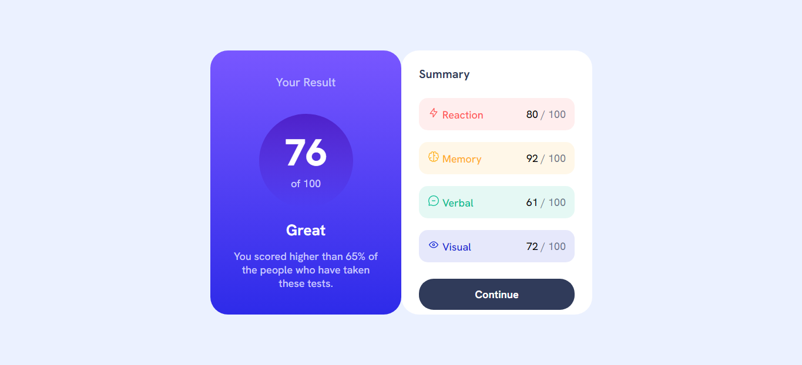

# Frontend Mentor - Results summary component solution

Esta é a solução para o [Desafio "Componente com sumário de resultados" do Frontend Mentor](https://www.frontendmentor.io/challenges/results-summary-component-CE_K6s0maV). 

## Tabela de conteúdo

- [Visão geral](#visão-geral)
  - [O Desafio](#o-desafio)
  - [Screenshot](#screenshot)
  - [Links](#links)
- [Meu processo](#meu-processo)
  - [Construído com](#construído-com)
- [Autor](#autor)

## Visão Geral

### O desafio

Tornar possível para o usuário:

- Vizualizar o layout da página otimizado para o tamanho de tela do dispositivo utilizado.
- Vizualizar estados de foco nos elementos interativos da página.

### Screenshot

### Links

- URL Solução: [https://github.com/EvandroBaraka/huddle-landing-page.git](https://github.com/EvandroBaraka/huddle-landing-page.git)
- URL Site: [https://evandrobaraka.github.io/huddle-landing-page/](https://evandrobaraka.github.io/huddle-landing-page/)

## Meu Processo

### Construído com:

- HTML5 
- Propriedades CSS
- Flexbox

## Autor

- Facebook - [Evandro Passaia](https://www.facebook.com/evandro.passaiaze)
- Frontend Mentor - [@EvandroBaraka](https://www.frontendmentor.io/profile/EvandroBaraka)
- Github - [@EvandroBaraka](https://github.com/EvandroBaraka)
- Linkedin - [Evandro Passaia](https://www.linkedin.com/in/evandro-passaia-62b9a5269/)
